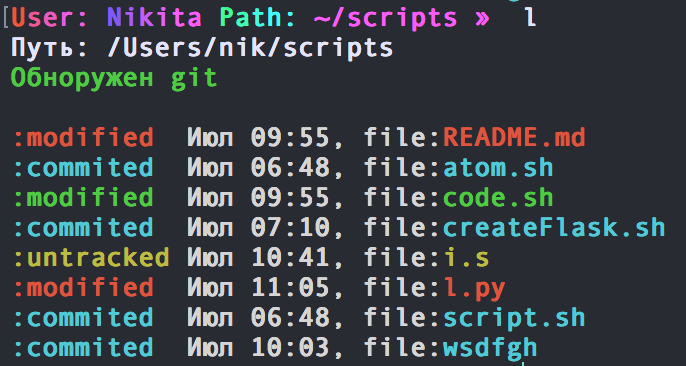
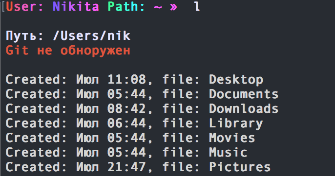

# Мои shell скрыпты

> для того что бы сделать файл испольнительным нужно:

```sh
chmod +x file_name
```

#### Что к чему:


| Файл | Что он делает |
| ------ | ------ |
| .zshrc | тут всё понятно |
| atom.sh | для открытии файлов в Atom |
| code.sh | для открытии файлов в VS Code |
| script.sh | просто так |
| createFlask.sh | создаёт файл для сервера |
| l.py | показывает имя/дата создания/и гит статус файлов в каталоге|


---
## Насчёт l.py

Для того что бы оно заработало в .zshrc/.bashrc нужно ввести 
```sh
alias l='путь/до/l.py'
```

### как пользоватся:

- для просмотра файлов просто вводим:
```sh
l
```
- что бы посмотреть скрытые файлы:
```sh
l -a
```

### Программка l в папке где есть git 
- 

### Программка l в папке где нет git
- 
---